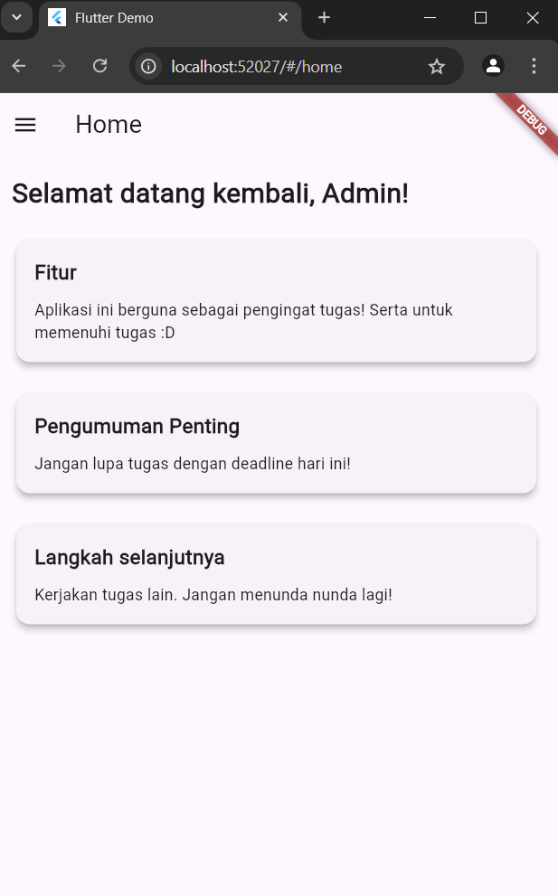

# tugastiga

A new Flutter project.

## Getting Started

This project is a starting point for a Flutter application.

A few resources to get you started if this is your first Flutter project:

- [Lab: Write your first Flutter app](https://docs.flutter.dev/get-started/codelab)
- [Cookbook: Useful Flutter samples](https://docs.flutter.dev/cookbook)

For help getting started with Flutter development, view the
[online documentation](https://docs.flutter.dev/), which offers tutorials,
samples, guidance on mobile development, and a full API reference.

Username : admin
Password : 1234

Aplikasi ini niatnya akan digunakan menjadi aplikasi pengingat dari tugas tugas yang ada. 

Pada halaman login (login_page.dart), pengguna memasukkan username dan password yang sudah ditentukan di dalam kode. Dua TextField digunakan untuk menerima input username dan password dari pengguna, setiap textfield memiliki controller yang digunakan untuk mengambil teks yang dimasukkan. Fungsi login akan mengecek apakah username dan password yang dimasukkan benar. Jika benar, status login disimpan di local storage dan pengguna diarahkan ke home page.

Halaman home page (home_page.dart) adalah halaman utama yang muncul setelah pengguna berhasil login. Halaman ini memiliki side menu (drawer) yang digunakan untuk navigasi ke halaman lain. Halaman home ini akan digunakan untuk pengingat. 

Halaman about page (about_page.dart) berfungsi sebagai halaman informasi. Halaman ini juga memiliki side menu.

Halaman setting page (settings_page.dart) berfungsi untuk logout dari aplikasi ini.

Untuk menyimpan data, SharedPreferences digunakan sebagai mekanisme penyimpanan data sederhana di perangkat lokal. Aplikasi bisa mengingat apakah pengguna sudah login meskipus aplikasi ditutup. 

## Screenshot

